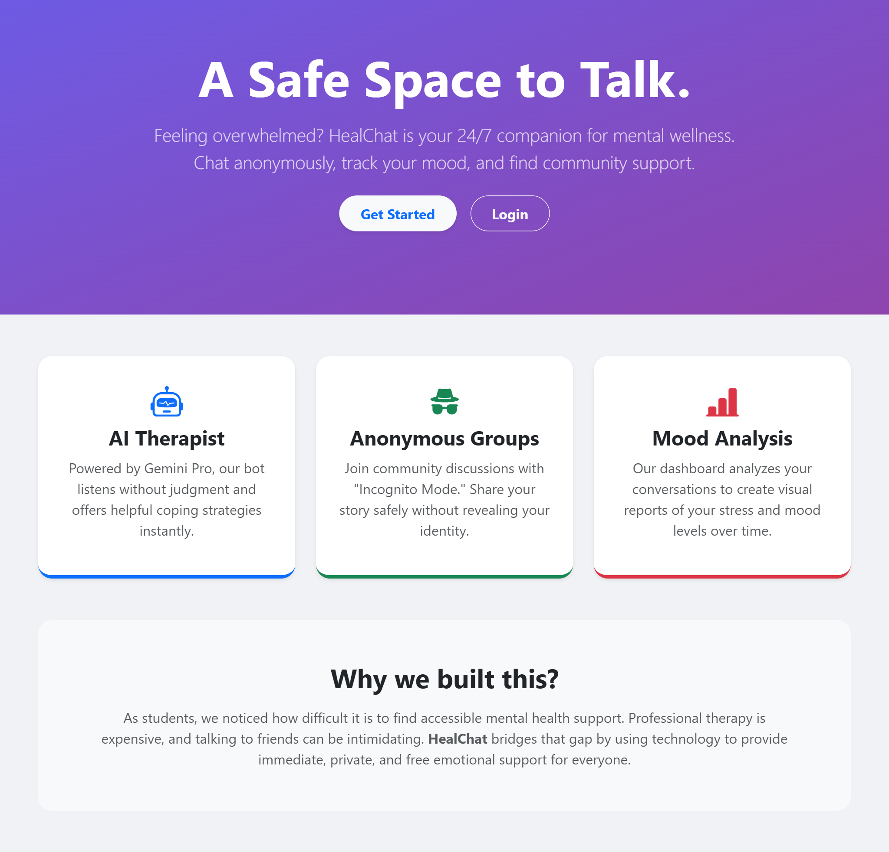
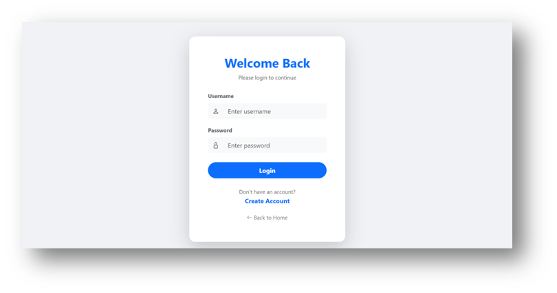
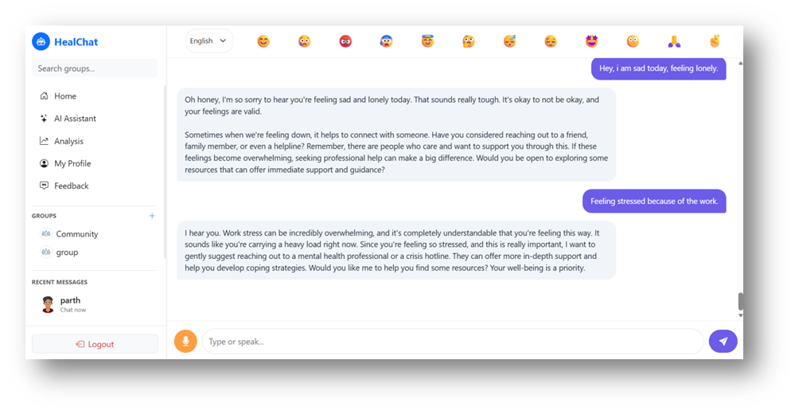
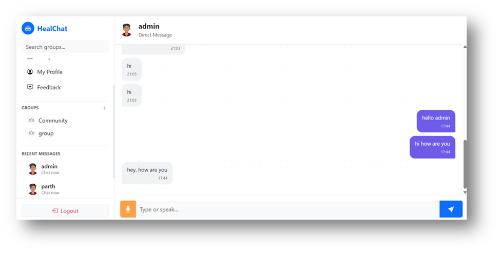
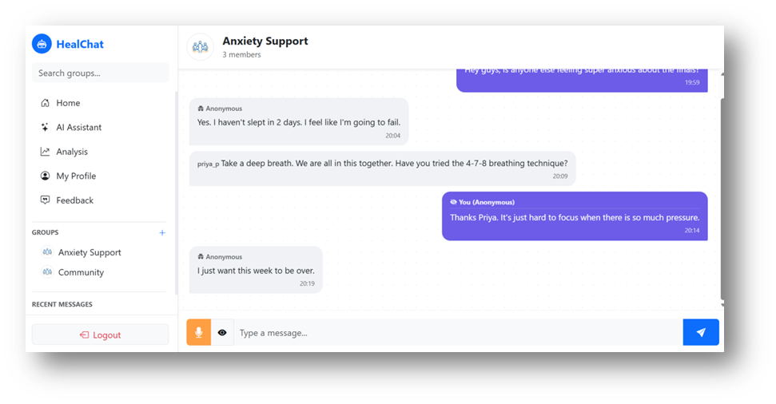
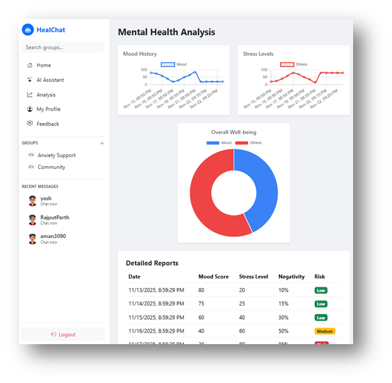

# HealChat – AI-Powered Mental Health Support Platform

HealChat is a Django-based mental health support platform that combines **AI-powered conversations**, **real-time messaging**, and **emotional analysis** to provide users with a safe, supportive, and interactive environment.  
The project focuses on **early mental health risk detection**, **peer communication**, and **empathetic AI assistance**.

---

## 🚀 Key Features

### 🤖 AI Mental Health Chatbot
- Emotion-aware AI responses using prompt engineering
- Empathetic, non-judgmental conversation flow
- Emergency trigger detection for high-risk messages
- Suggests professional help when critical conditions are detected

### 📊 Emotional Analysis & Risk Assessment
- Sentiment analysis using **TextBlob**
- Mood, stress, and negativity scoring
- Risk levels: **Low / Medium / High**
- Visual analysis reports for users

### 💬 Real-Time Chat System
- One-to-one direct messaging
- Group chat functionality
- WebSocket-based real-time communication using **Django Channels**
- Only visible chats for groups/users the user is part of

### 👤 User Profile System
- Custom user profiles with avatar support
- Online/offline presence tracking
- Emergency contact information
- Profile view differs for self vs other users

### 📱 Responsive UI
- Facebook-style chat layout
- Collapsible sidebar for small devices
- Mobile-first responsive design using Bootstrap

---

## 🛠️ Tech Stack

- **Backend:** Django, Django REST Framework
- **Real-Time:** Django Channels, WebSockets (ASGI)
- **Frontend:** HTML, CSS, Bootstrap, JavaScript
- **AI Integration:** External AI API (Prompt-based)
- **Sentiment Analysis:** TextBlob
- **Database:** SQLite
- **Authentication:** Django Auth System
- **Deployment (Demo):** ngrok

---

## 🗂️ Project Structure

```text
HealChat/
│
├── chatbot/
│   ├── views.py
│   ├── models.py
│   ├── serializers.py
│   ├── templates/chatbot/
│
├── group/
│   ├── models.py
│   ├── views.py
│   ├── consumers.py
│   ├── routing.py
│   ├── templates/
│
├── users/
│   ├── models.py
│   ├── middleware.py
│   ├── templates/users/
│
├── templates/
│   ├── chat_base.html
│
├── static/
├── media/
├── MindWell_AI/
│   ├── settings.py
│   ├── asgi.py
│   ├── urls.py
│
└── manage.py
```
## 📸 Screenshots

Add screenshots in the `/screenshots` folder and link them below.

- **Home Page**
  
  
- **Login & Registration Page**  
  

- **AI Chatbot Interface**  
  

- **Direct Messaging**  
  

- **Group Chat**  
  

- **Emotion Analysis Dashboard**  
  

---

## ⚙️ Setup & Installation

### 1️⃣ Clone the Repository
```bash
git clone https://github.com/your-username/HealChat.git
cd HealChat
```
### 2️⃣ Create Virtual Environment
```bash
python -m venv venv
```
Activate it:
Windows
```bash
venv\Scripts\activate
```
Linux / macOS
```bash
source venv/bin/activate
```
### 3️⃣ Install Dependencies
bash
Copy code
pip install -r requirements.txt
### 4️⃣ Environment Variables (IMPORTANT)
Create a .env file in the root directory and add:
env
```bash
API_KEY=your_ai_api_key_here
API_URL=your_ai_api_url_here
```
⚠️ AI API key and URL are required for chatbot responses to work.

### 5️⃣ Database Setup
```bash
python manage.py makemigrations
python manage.py migrate
```
### 6️⃣ Create Superuser (Optional)
```bash
python manage.py createsuperuser
```
### 7️⃣ Run the Server
```bash
python manage.py runserver
```
Open:
👉 http://127.0.0.1:8000
---
## 🔌 WebSocket Configuration
HealChat uses Django Channels for real-time chat.
Ensure the following:
channels installed
ASGI_APPLICATION set in settings.py
asgi.py configured using ProtocolTypeRouter
Channel layer enabled (Redis or In-Memory)
Example (settings.py):
```bash
ASGI_APPLICATION = "MindWell_AI.asgi.application"
CHANNEL_LAYERS = {
    "default": {
        "BACKEND": "channels.layers.InMemoryChannelLayer"
    }
}
```
## 🧪 Demo
- Project is demonstrated using ngrok for external access
- Real-time group chat, direct messaging, and AI responses shown live
- Used during project evaluation and presentation

## 👥 Team Contribution
### Parth Rajput
- Backend Development, AI Integration, Database Design, WebSockets,
- Django REST APIs, Sentiment Analysis, System Architecture
### Yash
- Frontend Development (UI Design, Responsiveness, Layout Styling)
Developed as a team academic project, with backend architecture and AI logic primarily implemented independently.

## ⚠️ Disclaimer
- HealChat is not a medical application.
- It does not provide medical diagnosis
- It does not replace professional mental health care
- Designed strictly for educational and supportive purposes

## 📌 Future Improvements
- Multilingual sentiment analysis (regional languages)
- Professional therapist integration
- Advanced NLP models
- Cloud deployment (AWS / Azure)

## 📄 License
- This project is intended for educational use only.

## 🙌 Acknowledgements
- Django & Django Channels
- TextBlob
- Bootstrap
- AI API Providers
